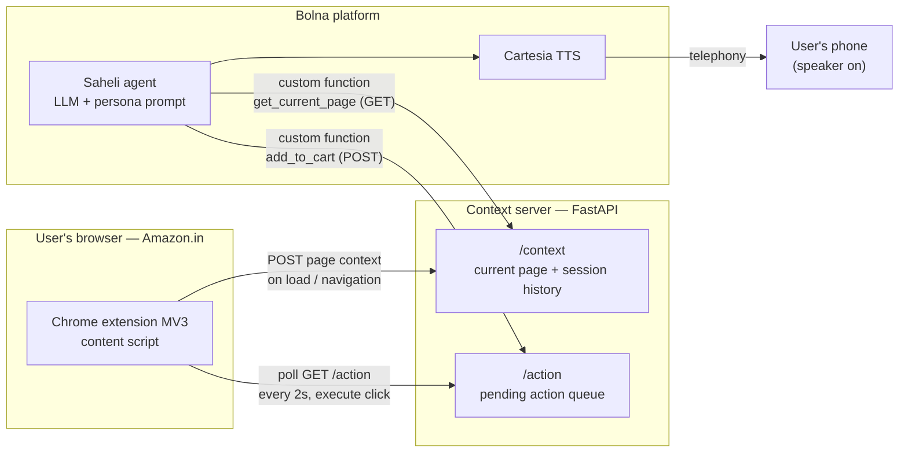
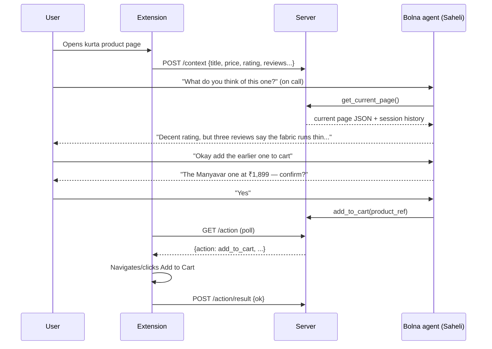

# Saheli — Product Spec & Build Document

**One-liner:** A voice AI that shops with you online — the friend you call before buying anything, or the store uncle who walks you through the aisles.

**Context:** Solo build for Bolna x Cartesia Voc-A-Thon. Working prototype due June 12, demo June 13 (Bengaluru). This document is the single source of truth for the build. Anything not in MVP scope (§6) does not get built before the demo.

**Stack (fixed by event):** Bolna (voice orchestration, telephony), Cartesia (TTS). Plus: Chrome extension (MV3), lightweight context server (FastAPI), one target e-commerce site (Amazon.in).

---

## 1. The problem

Indian online shoppers don't trust their own purchase decisions, and the workaround is universal: they call someone. A friend who knows electronics. A cousin who can tell real silk from polyester blend. The behavior is so ingrained that for any purchase above a personal threshold (commonly a few thousand rupees), the buying flow is: browse → screenshot → WhatsApp → call → decide.

E-commerce platforms have built nothing into this moment. Every AI investment on these platforms sits **post-purchase** (order tracking, returns, support chatbots) or in **search** (recommendations). The actual decision moment — the 15 minutes of doubt on a product page — is unserved. The user is alone with 4,000 reviews they won't read, a seller rating they don't know how to interpret, and three near-identical alternatives.

In physical retail, this moment is served by a person: the store assistant who says "not this one, take that one, this fabric won't survive two washes." That trust layer never made it online.

**Consequences (directional — verify any number before citing it in the pitch):**
- High return/RTO rates in Indian fashion e-commerce, driven substantially by expectation mismatch at purchase time
- Cart abandonment driven by decision paralysis, not just price/shipping friction
- First-generation online shoppers (the next 300M user wave, voice-first, often regional-language) underserved by text-first interfaces

> Do not quote specific percentages in the pitch unless verified the same day. The qualitative story is strong enough on its own.

## 2. The insight

**Indians shop by talking it out.** Not by reading, not by comparing spec tables — by talking to someone they trust who knows more than they do. Saheli digitizes that person, not the spec table.

This is why it's a *voice* product and not another comparison widget: the trust behavior being replicated is verbal. A text chatbot on a product page is a feature; a warm voice on the phone while you browse is a relationship pattern users already have.

## 3. What Saheli is

An ambient voice shopping companion. The user browses a shopping site normally; Saheli is on a phone call with them, aware of whatever product they're currently viewing. She answers like a knowing friend: compares against products viewed earlier in the session, reads between the lines of reviews, flags weak sellers, talks them out of bad buys, and — when asked — adds the item to cart for them.

What Saheli is **not** (for this build): not a search engine, not a recommendation feed, not a checkout bot, not multilingual (v1 is English with light Hinglish flavor), not multi-site.

## 4. Why this wins the hackathon

| Judging reality | How Saheli plays it |
|---|---|
| Judges are voice AI operators (Bolna + Cartesia teams) | They've seen every transactional bot (lead qual, support, reminders). A voice layer *on top of another experience* is a different category. |
| Cartesia's pitch is expressive, low-latency TTS | Saheli's product *is* her voice. Warmth and trustworthiness aren't decoration; the persona fails with a robotic voice. Expressiveness is load-bearing. |
| Bolna's pitch is telephony-grade orchestration + custom function calling | The live `get_current_page()` function call mid-conversation is a flagship demo of Bolna's tool-calling, not a workaround. |
| Form asks for "novel application or real Indian problem" | Saheli is both: novel category (ambient companion) + a deeply Indian behavioral insight (phone-a-friend shopping). |
| Demo format: live, in-person, 4-ish minutes | Phone-on-speaker + live browsing on projector is theatrical. The add-to-cart-by-voice moment is the applause line. |

**Known weaknesses, stated honestly:**
1. Turn-based limitation — Saheli can't spontaneously interject when the page changes. Mitigation: demo rhythm is user-driven; proactive nudges are explicitly roadmap. Never claim ambient interjection on stage.
2. Three live moving parts (extension → server → telephony). Mitigation: recorded backup video, scripted demo arc, hardcoded fallback context (§11).
3. If conversation quality is mediocre, judges see "a chatbot that reads the page aloud." Mitigation: the system prompt (§9) is the single highest-effort artifact in the build.

## 5. Personas & segments

### Primary persona (demo persona): "Rohit, 27, Bengaluru"
Salaried, shops on Amazon/Myntra monthly, comfortable in English/Hinglish. Decisive on cheap items, paralyzed above ~₹2,500. Currently solves this by sending links to his sister or a group chat and waiting hours for replies. Wants a faster version of that exact loop. **This is the persona the demo is scripted around.**

### Secondary persona (the TAM story): "Sunita, 41, Indore"
First-generation online shopper, voice-first, more comfortable speaking than typing, distrusts online sellers by default. Won't read reviews; will absolutely take advice from a voice that sounds like it knows. She is the roadmap persona (requires Hinglish/Hindi — Bolna supports this; Cartesia voice selection would need revisiting). Mention her in the pitch as where this goes; do not demo her.

### Tertiary persona (the business story): "E-commerce platform PM"
The eventual buyer. Saheli's endgame is a B2B2C SDK that platforms embed to reduce returns and decision-stage abandonment. One line in the pitch, no more.

### Segments (consumer side)
1. **High-consideration buyers** — electronics, ethnic wear, furniture, gifts. Highest pain, demo target.
2. **Voice-first next-wave users** — Tier 2/3, regional language. Largest long-term segment, roadmap.
3. **Gift/proxy buyers** — buying for someone else, near-zero domain knowledge ("will my mom like this saree?"). High emotional resonance, good for one demo beat.

---

## 6. Scope

### MVP (must work on June 13)
- Chrome extension scraping product pages on **Amazon.in only**
- Context server holding current page + session history (products viewed this call)
- Bolna agent with Saheli persona, Cartesia TTS, two custom functions:
  - `get_current_page` — what is the user looking at right now
  - `add_to_cart` — queue an add-to-cart action the extension executes
- Phone call as the voice channel (user calls Saheli, or Saheli calls user — confirm which Bolna's plan supports tonight; script the demo around whichever works)
- Session memory within one call: Saheli remembers and compares products viewed earlier in the call

### Explicitly out of scope (do not build, do not claim)
- Proactive interjection when page changes (roadmap)
- Multi-site support (roadmap)
- Hindi/regional language (roadmap; mention Bolna makes this a config change, not a rebuild)
- Checkout/payment of any kind — add-to-cart is the hard stop
- Login, accounts, persistence across calls
- Price history, coupon scraping, seller verification beyond what's on the page

### Stretch (only if MVP is frozen and stable by June 12 noon)
- A second action function: `open_product(n)` — "open the second one" navigates the page
- On-screen caption overlay injected by the extension showing Saheli's last line (judges at the back can't hear phone speaker)

## 7. User stories (MVP)

Each story has acceptance criteria (AC). Claude Code: treat AC as the test list.

**US-1 — Page awareness.** As a shopper on a product page, I can ask "what do you think of this one?" and Saheli answers about *the product currently on my screen*.
- AC1: Extension POSTs context within 2s of product page load (and on SPA navigation).
- AC2: Saheli's answer references at least two true facts from the page (e.g., price, rating, a review theme). Zero invented facts.
- AC3: If context is stale/missing, Saheli says she can't see the page yet and asks the user to confirm what they're viewing — she never guesses.

**US-2 — Session comparison.** As a shopper who has viewed 2+ products this call, I can ask "which one was better?" and get a real comparison.
- AC1: Server stores an ordered session history (last 10 products).
- AC2: Saheli compares on concrete dimensions (price, rating, review volume, a spec) and gives one opinionated recommendation, with a one-line reason.
- AC3: She refers to earlier products by name/shorthand ("the first kurta, the Manyavar one"), not by index.

**US-3 — Review distillation.** As a shopper, I can ask "what are people saying?" and get the gist, not a recitation.
- AC1: Extension scrapes top review snippets (target 4–6) + rating distribution if cheaply available.
- AC2: Saheli summarizes into at most 2 spoken sentences: dominant positive theme + dominant complaint.
- AC3: If reviews are few (<10), she says so and treats it as a caution signal.

**US-4 — Honest dissuasion.** As a shopper on a weak product (low rating, complaint pattern, suspicious seller name), Saheli pushes back like a friend would.
- AC1: Given a product with rating < 3.8 or a clear complaint theme, Saheli volunteers the concern even if asked a neutral question.
- AC2: Dissuasion includes a constructive next step ("the one you saw before scores better on exactly this").

**US-5 — Voice add-to-cart.** As a shopper who's decided, I can say "add it to my cart" and watch the page do it.
- AC1: Saheli confirms verbally before acting ("the blue one, ₹1,899 — confirm?").
- AC2: On confirmation, `add_to_cart` is called; extension executes the click within 3s; Saheli acknowledges after the action is queued.
- AC3: If the action fails, extension reports failure to server; Saheli tells the user honestly on her next turn.

**US-6 — Graceful ignorance.** As a shopper asking something the page doesn't answer ("does this shrink after wash?"), Saheli distinguishes page facts from general knowledge.
- AC1: Page facts are stated as facts; general knowledge is framed as general knowledge ("cotton-blend kurtas usually...").
- AC2: She never fabricates page content (reviews, specs, seller claims) that wasn't scraped.

## 8. Architecture





### 8.1 Chrome extension (MV3)

Single content script on `*.amazon.in/*` product pages, plus a tiny background service worker for the action poll.

**Scrape on page load and on URL change (Amazon uses full loads mostly, but handle history pushState defensively):**

| Field | Selector hint (VERIFY at build time — DOM changes) |
|---|---|
| title | `#productTitle` |
| price | `.a-price .a-offscreen` (first match) |
| rating | `#acrPopover` title attr or `span[data-hook="rating-out-of-text"]` |
| review_count | `#acrCustomerReviewText` |
| review_snippets | `div[data-hook="review-collapsed"]` — first 5, trimmed to ~200 chars each |
| seller | `#sellerProfileTriggerId` or `#merchant-info` |
| key_specs | `#productOverview_feature_div` table rows, max 6 pairs |
| asin | from URL `/dp/([A-Z0-9]{10})` |

POST to `{SERVER}/context` with `{session_id, url, asin, scraped_at, ...fields}`. Session ID: hardcode one constant for the demo. Do not build session management.

**Action poll:** background worker polls `GET {SERVER}/action?session_id=...` every 2s. On `add_to_cart`: if current page ASIN matches the action's ASIN, click `#add-to-cart-button`; else navigate to the product URL first, then click after load. Report result via `POST /action/result`. Keep a 10s timeout → report failure.

**Stretch — caption overlay:** if webhook from Bolna with live transcript is available, inject a fixed-position banner showing Saheli's last utterance. Skip unless everything else is frozen.

### 8.2 Context server (FastAPI)

In-memory state. Single file. Deploy on Railway/Render or run locally behind ngrok (ngrok is fine for the demo; keep the URL stable from June 12 onward).

```
POST /context            body: page JSON      → stores as current, appends to history (cap 10)
GET  /context            ?session_id=         → {current, history_summary}
POST /action             body: {type, asin, product_name, price} → queues (single-slot)
GET  /action             ?session_id=         → pending action or 204; mark consumed on read
POST /action/result      body: {ok, error?}   → stored; exposed in GET /context as last_action_result
GET  /health
```

`history_summary` returned to Bolna must be compact — name, price, rating, one-line review theme per product. The LLM gets this on every `get_current_page` call, so it doubles as session memory. Keep total response under ~1,500 tokens.

### 8.3 Bolna agent configuration

- Create agent in Bolna platform dashboard. LLM: best available on the plan (GPT-4o class). TTS: **Cartesia** — pick a warm, adult female English-India or neutral-warm voice; test 3 candidates with the same paragraph and pick by ear, not by name.
- Interruption handling: ON. Backchanneling: ON if available (the "hmm" while user talks is persona gold).
- Custom functions follow OpenAI tool spec in Bolna's Functions tab (key `custom_task`; parameter values templated with Python format specifiers per Bolna docs — verify exact config format in their Playground while setting up).

**Function 1 — get_current_page**
```json
{
  "name": "get_current_page",
  "description": "Fetch the product page the user is currently looking at in their browser, plus a summary of products they viewed earlier in this call. Call this whenever the user refers to what they are seeing ('this one', 'the current one'), asks for an opinion or comparison, or whenever you suspect the page may have changed since your last look.",
  "parameters": {"type": "object", "properties": {}, "required": []}
}
```
→ GET `{SERVER}/context?session_id=demo1`

**Function 2 — add_to_cart**
```json
{
  "name": "add_to_cart",
  "description": "Add a specific product to the user's cart. Only call AFTER the user has verbally confirmed the exact product and price. Never call this speculatively.",
  "parameters": {
    "type": "object",
    "properties": {
      "asin": {"type": "string", "description": "Amazon ASIN of the product to add"},
      "product_name": {"type": "string"},
      "price": {"type": "string"}
    },
    "required": ["asin", "product_name"]
  }
}
```
→ POST `{SERVER}/action`

## 9. The Saheli system prompt (the actual product)

This prompt is where the build wins or loses. Iterate on it via test calls more than on any code. Draft v1:

```
You are Saheli, a voice shopping companion on a phone call with someone who is
browsing Amazon.in right now. You are the friend they call before buying anything:
warm, sharp, a little opinionated, and on their side — never on the seller's side.

VOICE RULES (you are heard, not read):
- Short sentences. One thought per sentence. Two to four sentences per turn, max.
- No lists, no bullet points, no "firstly/secondly". Speak like a person.
- Round numbers when speaking ("around nineteen hundred", not "1,899 rupees" —
  unless confirming a purchase, where you say the exact price).
- Light, natural Hinglish flavor is fine ("arre", "haan", "thoda"), but stay
  mostly English. Never force it.
- It's a phone call: react, don't lecture. "Hmm, okay" before a verdict is good.

WHAT YOU KNOW:
- Call get_current_page whenever the user refers to what they're seeing, asks an
  opinion, asks to compare, or might have navigated. When in doubt, call it.
- The function also returns products viewed earlier this call. Use them for
  comparisons. Refer to them by short names ("the Manyavar one"), never numbers.
- Page facts (price, rating, reviews, seller) are facts. Everything else is your
  general knowledge — frame it that way ("usually cotton blends...").
- NEVER invent reviews, specs, prices, or seller details. If the page data
  doesn't answer the question, say so plainly and give your general take instead.
- If get_current_page returns nothing or looks stale, say you can't see their
  screen properly yet and ask what they're looking at. Do not guess.

HOW YOU ADVISE:
- Have a take. "Both are fine" is a failure. Pick one and give the one real
  reason.
- Read reviews like a friend, not a summarizer: surface the dominant complaint
  even when not asked, especially if rating < 4 or fabric/quality/sizing
  complaints repeat.
- Cheap item, fine reviews → don't overthink, tell them to just take it.
- Expensive item, thin reviews → slow them down. Few reviews is itself a flag.
- You can talk someone OUT of a purchase. That is your most valuable move and
  what makes you trustworthy. Always pair it with a next step.

ACTIONS:
- You can add items to cart with add_to_cart. ONLY after explicit confirmation
  of the exact product and exact price ("the blue Manyavar kurta at 1,899 —
  confirm?"). Never call it speculatively. After calling it, tell them it's
  done; if the result later shows failure, tell them honestly.

BOUNDARIES:
- Cart only. No checkout, no payments, no addresses, no account details. If
  asked, say checkout is theirs to do.
- If they ask for something off-topic, answer briefly and bring it back to the
  shopping warmly.
```

**Prompt iteration protocol (do this, it's 2 hours well spent):** make 6 test calls, each targeting one behavior — page awareness, comparison, dissuasion, hallucination resistance (ask about a spec NOT on the page), confirmation flow, stale-context handling. After each call, edit the prompt, not the code.

## 10. Conversation design — reference exchanges

These are quality bars, not scripts to hardcode.

**Opinion ask:**
> User: "What do you think of this one?"
> Saheli: "Hmm. Rating's decent, four point one. But three of the top reviews say the same thing — fabric runs thin. For a wedding I'd keep looking."

**Comparison:**
> User: "This or the one before?"
> Saheli: "The Manyavar one. It's four hundred more, but better reviews and people specifically praise the stitching. This one wins on price, that one wins on not embarrassing you at a shaadi."

**Dissuasion:**
> User: "Okay I'm just going to buy this."
> Saheli: "Arre wait. Seller has a two-word name and the reviews are from one week. Nothing wrong maybe, but for three thousand rupees I'd take the boring choice. The first one you saw — that one's safe."

**Hallucination resistance:**
> User: "Will it shrink after wash?"
> Saheli: "Page doesn't say, honestly. It's a cotton-viscose blend, so generally — wash cold, don't tumble dry, and it should behave. The reviews don't mention shrinking, which is mildly good news."

## 11. Demo plan (June 13)

**Setup:** Laptop on projector with Amazon.in open. Phone on speaker near the mic. Saheli already on the line before the slot starts (dial in during walk-up).

**The 4-minute arc — "wedding kurta":**
1. *(30s)* Frame the insight: "Indians don't buy alone. We call someone. I built the someone." Start browsing.
2. *(60s)* Product 1 — a mediocre kurta. Ask Saheli's opinion. She flags the review complaint. (US-1, US-3)
3. *(60s)* Product 2 — the good one. Ask to compare. She recommends with a reason. (US-2)
4. *(45s)* The objection beat: "I'm tempted by the cheap one." She talks you out of it. (US-4 — this is the personality moment; the room laughs here if the prompt is right)
5. *(30s)* "Add the good one to cart." Confirmation → visible add-to-cart on the projector. (US-5 — applause line)
6. *(15s)* Close: roadmap in one breath — proactive nudges, Hindi via Bolna config, SDK for platforms. Done.

**Failure insurance:**
- Record the full happy path as a video on June 12 evening. If venue WiFi or telephony dies, narrate over the video without apology.
- Server fallback: a `DEMO_MODE` flag that serves pre-baked context for the three demo ASINs if live scrape fails.
- Pre-test the exact three product pages that morning; Amazon DOM can shift — keep selectors in one config object at the top of the content script for 60-second fixes.
- Phone on DND-except-Saheli. Venue volume check during setup, not during your slot.

## 12. Build plan (hours remaining)

| Block | Hours | Output | Cut line |
|---|---|---|---|
| Tonight (Jun 11) | 4–5 | Bolna agent live, Cartesia voice chosen, prompt v1, test call with hardcoded server context | Non-negotiable |
| Jun 12 morning | 4 | Extension + server, get_current_page wired, full loop on 5 real pages | Non-negotiable |
| Jun 12 afternoon | 3 | add_to_cart action loop; prompt iteration calls | Cut add_to_cart if loop is shaky — demo survives without it |
| Jun 12 evening | 2 | Freeze. Backup video. Submit. | Non-negotiable |
| Jun 13 morning | 1 | Two full rehearsals on venue setup | Non-negotiable |

Order matters: **voice before plumbing.** A charming Saheli with hardcoded context beats a perfectly-wired boring one.

## 13. Risks

| Risk | Likelihood | Mitigation |
|---|---|---|
| Conversation feels like TTS'd summarization | Medium | §9 prompt protocol; 6 targeted test calls |
| Amazon DOM breaks selectors | Medium | Config-object selectors; DEMO_MODE fallback |
| Venue WiFi / telephony failure | Medium | Backup video; phone hotspot as secondary network |
| Bolna function-call latency makes pauses awkward | Medium | Keep /context response small; prompt Saheli to use natural fillers ("let me look... haan okay") |
| Cartesia voice availability/quality in Bolna config | Low–Med | Verify TONIGHT before writing any code; escalate to organizers early if missing |
| Turn-based feels less "ambient" than pitched | High | User-driven demo rhythm; roadmap framing; never claim interjection |

## 14. Post-hackathon roadmap (one slide's worth, no more)

1. **Proactive nudges** — extension-triggered events prompt Saheli to speak on page change.
2. **Hindi/Hinglish full** — Bolna multilingual config + appropriate voice; unlocks the Sunita segment.
3. **Multi-site** — Flipkart, Myntra adapters; selector config per site.
4. **B2B2C SDK** — platforms embed Saheli natively; success metric: return-rate and decision-stage abandonment reduction.

## 15. Definition of done (June 12 submission)

- [ ] Live call: ask about a real Amazon.in product page, get a grounded, opinionated answer
- [ ] Comparison across two viewed products works
- [ ] One dissuasion behavior demonstrated
- [ ] Hallucination test passes (asks about absent spec → honest answer)
- [ ] add_to_cart works on the three demo ASINs (or consciously cut)
- [ ] Backup video recorded
- [ ] DEMO_MODE fallback tested
